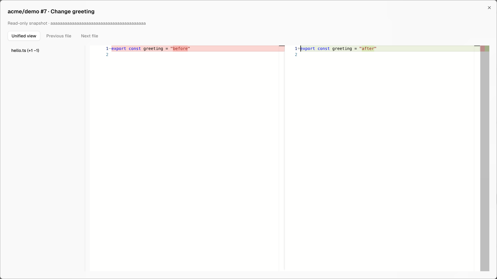

# CV Hub for Orca

Desktop plugin for CV Hub hosted Git repositories. Sign in with CV Hub in your browser, browse repositories and pull requests, open their changes in **Orca's native Monaco DiffViewer**, inspect CI checks and review history, submit a top-level review, and search code through CV Hub's Streamable HTTP MCP server.

**Requires Orca with the hardened native plugin review host — [lamtuanvu/orca PR #1](https://github.com/lamtuanvu/orca/pull/1) at commit `75b02825` ([contract](https://github.com/lamtuanvu/orca/blob/75b02825f77fae229b4c4e91f42f6600e761c61a/docs/reference/plugin-panel-review-api.md)) — and a CV Hub deployment with the plugin's OAuth client registered. No CV Hub code change is needed: the plugin uses the same API as CV Hub's web app. Stock Orca cannot load this plugin.** Orca 1.4.197 is the research base, not a claim of compatibility with its unpatched release. Nothing here installs over your existing Orca app or registers MCP with your coding agent automatically.

## Build and install

This repository holds the plugin only; the server side lives in [controlvector/cv-hub](https://hub.controlvector.io/controlvector/cv-hub). Design notes and the original implementation plan are in [`docs/design/`](docs/design/).

1. Register the plugin's public OAuth client once per CV Hub deployment, with the registration script CV Hub already ships for device-flow clients (`apps/api/scripts/register-device-agent-client.ts`, the one `cva` uses). It is idempotent and creates no secret:

   ```sh
   # in the cv-hub repository, against the target deployment's database
   cd apps/api && DEVICE_CLIENT_ID=cv-hub-orca DEVICE_CLIENT_NAME="CV Hub for Orca" \
     DEVICE_SCOPES=profile,repo:read,repo:write,offline_access \
     env -u NODE_OPTIONS npx tsx --env-file=.env scripts/register-device-agent-client.ts
   ```

   The script loads the API's full configuration, so point `--env-file` at the target deployment's environment (or export `DATABASE_URL` and use `pnpm --filter @cv-hub/api register:device-agent-client`). Confirm with `GET <api-origin>/oauth/client-info/cv-hub-orca`.

   This upserts client `cv-hub-orca` ("CV Hub for Orca"): public, device grant, scopes `profile repo:read repo:write offline_access`, not first-party, so CV Hub shows its consent screen. Refresh tokens work as they do for `cva`: CV Hub issues one for `offline_access` and doesn't limit refreshes by grant type.
2. In this repository, run:

   ```sh
   pnpm install --frozen-lockfile
   pnpm build
   node scripts/check-package.mjs
   ```

3. Get the hardened Orca host: either check out `75b02825` from `https://github.com/lamtuanvu/orca`, or apply the bundled patch (exactly `8d6fec59..75b02825`) to a clean upstream checkout:

   ```sh
   git clone https://github.com/stablyai/orca.git /tmp/orca-cv-hub
   git -C /tmp/orca-cv-hub checkout 8d6fec597bfae3f1e1bf961a6cae2837f925a3b2
   node scripts/apply-host-patch.mjs /tmp/orca-cv-hub
   ```

   Follow that checkout's prerequisites and build instructions (`pnpm install`, `pnpm run build:desktop`). For an interactive launch, use the command below from the Orca checkout. `ORCA_DEV_USER_DATA_PATH` selects a development profile; do not use `ORCA_E2E_USER_DATA_DIR`, which requires the test harness's disposable-home setup. The host patch is pinned to the commit in [host-patches/base.json](host-patches/base.json); rebasing onto other versions needs review.

   ```sh
   env -u NODE_OPTIONS -u ELECTRON_RUN_AS_NODE -u ORCA_BACKGROUND_LAUNCH \
     -u ORCA_E2E_USER_DATA_DIR -u ORCA_E2E_HOME_DIR \
     NODE_ENV=development \
     ORCA_DEV_USER_DATA_PATH=/tmp/orca-cv-hub-profile \
     node node_modules/electron/cli.js .
   ```

4. In the patched Orca, enable the plugin system in Settings → Plugins, install a local folder using the **absolute path to this repository's `dist/`**, then review and enable **CV Hub**. `pnpm run package` checks the build; to make a ZIP of the same three files, run `cd dist && zip -X ../artifacts/cv-hub-orca-0.3.0.zip main.mjs panel.html orca-plugin.json` (`artifacts/` is not committed) and can be extracted into a local install folder.

   **Upgrading from 0.2.x** keeps the same capabilities, so Orca doesn't ask for new permissions; reopen any review left open from 0.2.x. **Upgrading from 0.1.x requires re-approval.** 0.2.0 declares new capabilities (`browser:authorize`, panel command contracts, the `cvhub.pullRequest` review provider) and drops the PAT flow, so Orca's consent fingerprint changes: review and enable the plugin again in Settings → Plugins. A saved PAT from 0.1.x is deleted after the first OAuth sign-in or sign-out.
5. Open **CV Hub** in the right sidebar. Under **Connection settings**, enter the CV Hub **API origin** (not its frontend URL or an `/api` path; locally `http://localhost:3001`). HTTPS is required except for loopback development servers. Choose **Sign in with CV Hub**, then **Continue in browser** and approve the code on CV Hub's `/device` page. Approving read-only still allows browsing; publishing reviews needs `repo:write` and repository write access.
6. Choose a repository and PR, then **Open changes in Orca**. Close the native review dialog to submit feedback from the sidebar.



## What the native review does

The review is built from the two endpoints CV Hub's own pull-request page uses. `GET .../pulls/:number/diff` fixes the revision: the target tip and source head SHAs, the changed files, and each file's patch (hunks relative to the merge base, which is what `base...head` diffs against). For each file Orca asks for, the worker loads the new side from `GET /api/v1/repos/:owner/:repo/blob/<headSha>/<path>` and rebuilds the old side by undoing that file's patch, which gives the merge-base version even after the target branch has moved on. Renames and copies, additions, deletions, empty files and missing final newlines are handled; the reconstruction is checked against git's own diffs in the tests. If a patch doesn't match the file, that file shows an error, never a guessed or empty original.

The diff is cached in the worker per review revision; after a worker restart it is refetched, and if the PR has moved on since the review opened, its files report that the pull request changed. Files whose patch CV Hub truncates (over 256 KiB, or past its 4 MiB total) show the new side with the old side marked as too large.

Orca owns the file navigation and read-only DiffViewer, with side-by-side/unified modes and model cleanup. Provider context and file contents stay out of the sandboxed iframe. Binary/non-UTF-8 files and files above 2 MiB are shown as explicit unsupported/limited states. Snapshot metadata is limited to 2,000 files / 1 MiB. File contents load lazily, one file at a time; only the diff is cached.

This version uses a native **dialog with one selected file**, not a central editor tab or combined scrolling diff. It does not stage, edit, merge, check out branches, or create inline threads. GitHub-mirrored repositories, Orca remote/web clients, and inline comments are outside this version.

## Reviews and authentication

Sign-in is the OAuth 2.0 device authorization grant (RFC 8628) with the public client `cv-hub-orca`. The worker requests the code, polls `/oauth/token` (honoring `interval`, `slow_down`, expiry, denial, and a bounded offline backoff), and verifies identity (`/api/auth/me`) and MCP discovery with the new token before declaring the connection complete. The device code, access token and refresh token never reach the panel: the panel sees an opaque attempt ID, the user code, the verification address, and the account profile. Tokens live only in Orca's encrypted secret store; profile metadata uses private plugin storage.

The worker validates the verification address before offering to open it: it must be CV Hub's `/device` page on the API origin, or on the web host beside an `api.` API host (API `https://api.hub.example.com` → page `https://hub.example.com/device`), which is how CV Hub is deployed. A loopback API accepts a loopback page on any port, for local development. It then registers the URL with Orca (`browser.createAuthorization`, remaining lifetime capped at 900 s) and asks Orca to open it (`browser.openAuthorization`), which shows a native confirmation naming the server and destination. The panel command returns immediately; the confirmation outcome arrives through status polling, and each handle is cancelled after use, on completion, denial, failure or cancellation. Orca's handles never reach the panel. When Orca can't open the browser — declined, rate limited (one request per ten seconds), reset by a plugin refresh, missing host support, or an address the worker couldn't verify — the panel says why and always shows the user code and a copyable verification address. **Copy code**/**Copy address** use the clipboard when the sandbox allows it and otherwise select the text for ⌘C/Ctrl+C.

Refreshes are serialized and the rotated refresh token is persisted before use. A rejected refresh marks the session expired (**Sign in again**) without discarding repository selection or drafts for that account. A 401 on a read refreshes once and retries; writes are never replayed. Sign-out cancels any pending attempt, deletes local credentials first, then revokes the refresh and access tokens on the server and reports a failed revocation separately. Profiles saved by the earlier PAT version are shown a **Sign in again** prompt; the PAT is deleted after OAuth sign-in or sign-out and is never used as an OAuth token. Connections reject redirects and cross-origin MCP discovery. A new sign-in invalidates old native-review contexts. Authorization attempts live in the worker: reloading the panel resumes a pending attempt, but a worker restart ends it and the user starts again.

The panel compares the revision you inspected with the source branch's live head (`GET /api/v1/repos/:owner/:repo/commits?ref=refs/heads/<branch>&limit=1`), not the PR's `sourceSha` field, which CV Hub sets when the PR is created. Before submitting, the worker checks the head again and refuses a review of a revision that is no longer current. The submission also carries `expectedHeadSha`. CV Hub versions without the review-integrity fix ignore that field, so a push landing between the check and the submission can't be caught, and those versions record every review against the PR's creation-time commit and count approvals from any commit. Once the fix is deployed, CV Hub rejects a stale submission with 409 and counts approvals only for the commit being merged. Write requests are never automatically retried; after an uncertain result the panel requires reloading the review history, and only allows a retry once it confirms the review is absent. Feedback drafts are kept in the panel's memory, keyed by server, account, repository and PR; they are cleared on sign-out.

MCP code search discovers `search_code` on the authenticated `/mcp` endpoint; it returns up to eight bounded snippets. The panel displays the endpoint for separate coding-agent setup. Plugin installation does not add agent tools or skills.

## Orca host contract

The plugin targets the hardened host contract at `75b02825`:

- **Explicit panel commands** (`commands:invoke-own`). Only commands with a `panel` contract in `orca-plugin.json` are callable from the iframe, each with a bounded input/output schema that Orca validates before running the command and before replying. The contracts live in `src/shared/panel-contracts.ts`; the build writes them into the manifest, and the worker checks its own view models against them too. Exposed: sign-in status/start/cancel/continue, sign-out, paginated repositories and pull requests, PR details, checks, reviews, review submission, code search. Nothing generic (no fetch, URLs, methods or tokens) is exposed.
- **Native review provider** (`diffs:open`). `contributes.reviewProviders` declares `cvhub.pullRequest` → snapshot `cvhub.getReview`, content `cvhub.readReviewFile`; both loaders are worker-only commands without panel contracts. The panel calls `diffs.openReview({ providerId: "cvhub.pullRequest", args: { owner, repo, number } })` and receives only `{ reviewId, revision }`. Failed file reads return an `error` side for that file.
- **Worker-only browser authorization** (`browser:authorize`), described above. `browser.openExternal` no longer exists.

Refreshing, updating or disabling the plugin invalidates open reviews and pending browser handles; the panel asks you to reopen the review or start sign-in again. A worker restart ends a pending sign-in. The worker remains subject to Orca's trusted-plugin model: approving it grants native code execution; these capabilities describe what the panel may ask the host to do, not a Node sandbox.

## Verification

```sh
pnpm type-check
pnpm test
pnpm build
node scripts/check-package.mjs
```

The Electron test for this plugin version is `e2e/cv-hub-plugin.spec.ts` (device-flow sign-in against a local fixture API, then the native diff). Copy it into the Orca checkout's `tests/e2e/`, then, after its E2E build prerequisites:

```sh
ORCA_BACKGROUND_LAUNCH=1 CV_HUB_PLUGIN_PATH=/absolute/path/to/cv-hub-orca-plugin/dist pnpm exec playwright test --config tests/playwright.config.ts cv-hub-plugin.spec.ts --workers=1
```

See [VALIDATION.md](VALIDATION.md) for the executed checks and environment limits.
