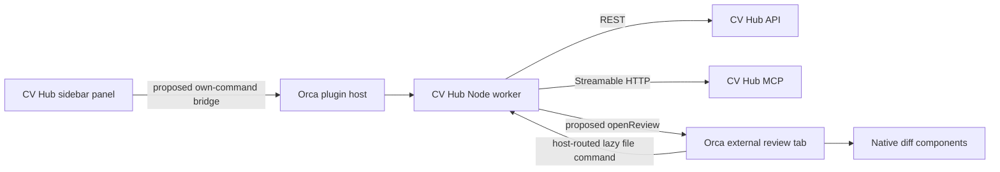

# CV Hub in Orca: research and proposed design

Status: proposed for review; no implementation has been made. Researched 2026-09-23.

## Intent and scope

Bring CV Hub capabilities into Orca as an interactive plugin. The user's highest priority is viewing pull request changes through Orca's own file diff system. Success means selecting a CV Hub PR, browsing its changed files, and reviewing accurate before/after contents in Orca's native editor without cloning or checking out the PR.

Planning assumptions: desktop first; CV Hub hosted Git repositories first; PR browsing, checks, review history, and review submission before the broader intelligence/task dashboard. The optional scope question has not yet been answered. These assumptions can be changed without discarding the research.

## Research baseline

- Orca upstream: [stablyai/orca](https://github.com/stablyai/orca), inspected commit `8d6fec597bfae3f1e1bf961a6cae2837f925a3b2`; package version `1.4.197`. This is a source snapshot, not a verified installed/released version.
- CV Hub: local task worktree, commit `48e729bd10e8969eb8b79bc525396577c93ba0e4`.
- Orca source was read from a local checkout for inspection. No live Orca plugin or CV Hub deployment was exercised.
- Source implementations take precedence over overview documentation. In particular, CV Hub's actual PR prefix is `/api/v1`, and its main MCP endpoint is `/mcp`.

## What Orca currently exposes

| Facility | Verified behavior | Design consequence |
| --- | --- | --- |
| Manifest | `orca-plugin.json`, `manifestVersion: 1`, `pluginApi: 1`, publisher/id, engine minimum, optional Node `main` | Package identity should be `controlvector.cv-hub` |
| UI | HTML panels in the right sidebar; host theme tokens | Build a compact CV Hub panel with bundled inline JS/CSS |
| Isolation | Panel iframe uses `allow-scripts`; CSP has `connect-src 'none'` | A panel cannot directly fetch REST/MCP or access parent internals |
| Worker | Default `activate(orca)` export; declared commands and event handlers; trusted Node execution in a separate process | Put network clients and credentials in the worker |
| Host API | Context, terminal input, notifications, private storage/settings/secrets, event subscriptions | No public editor/diff API or SCM-provider extension point |
| Panel bridge | Only `workspace.readContext`, `terminal.sendText`, `notifications.show` are panel-callable | No supported panel-to-own-worker call today |
| Workspace context | Display name, branch, terminal IDs; no repository remote or stable public worktree ID | Select the CV Hub repository explicitly in v1 |
| Events | Worktree created/removed and agent status changed | No built-in CV Hub notification/change stream |
| Installation | Local directories, pinned Git source, dev directories; immutable installed content | Develop locally, publish a self-contained release root |
| MCP | No MCP-server contribution in the manifest | Connecting agents' MCP configurations is a separate workflow |

The plugin API is explicitly experimental. Node-worker trust is separate from individual host capabilities; the current capability list does not sandbox arbitrary Node network/filesystem access. Do not invent a currently supported `net:fetch`, `editor.openDiff`, or `mcpServers` manifest field.

Source: [manifest](https://github.com/stablyai/orca/blob/8d6fec597bfae3f1e1bf961a6cae2837f925a3b2/src/shared/plugins/plugin-manifest.ts), [host API](https://github.com/stablyai/orca/blob/8d6fec597bfae3f1e1bf961a6cae2837f925a3b2/src/shared/plugins/plugin-host-api.ts), [panel CSP](https://github.com/stablyai/orca/blob/8d6fec597bfae3f1e1bf961a6cae2837f925a3b2/src/shared/plugins/plugin-panel-shell.ts), [worker API](https://github.com/stablyai/orca/blob/8d6fec597bfae3f1e1bf961a6cae2837f925a3b2/src/main/plugins/plugin-host-runtime.ts), [sample plugin](https://github.com/stablyai/orca/tree/8d6fec597bfae3f1e1bf961a6cae2837f925a3b2/examples/plugins/hello-orca).

## Native diff feasibility

**Feasible with an Orca host extension; the current plugin API alone is insufficient.**

Orca's `DiffViewer` accepts `originalContent`, `modifiedContent`, independent model keys, a language, and an editable flag. Its PR UI already loads remote file contents and reuses native `DiffSectionItem`, the combined file tree, virtualized sections, and diff preferences. We should reuse those rendering primitives through a new generic external-review surface. The existing GitHub wrapper is coupled to GitHub API calls, comments, and identities; passing a CV Hub URL into it will not work.

The CLI is not an alternative remote-content API: `orca file diff` only opens staged or unstaged workspace diffs. Treating a PR as a dirty working tree would change semantics and risk involving unrelated edits.

Sources: [diff props](https://github.com/stablyai/orca/blob/8d6fec597bfae3f1e1bf961a6cae2837f925a3b2/src/renderer/src/components/editor/diff-viewer-props.ts), [native PR renderer](https://github.com/stablyai/orca/blob/8d6fec597bfae3f1e1bf961a6cae2837f925a3b2/src/renderer/src/components/pull-request-page/files/combined-diff-viewer.tsx), [file CLI](https://github.com/stablyai/orca/blob/8d6fec597bfae3f1e1bf961a6cae2837f925a3b2/src/cli/specs/file.ts).

## CV Hub contracts and gaps

| Capability | Existing interface | Notes |
| --- | --- | --- |
| Connection discovery | `GET /api/mcp/connection-info` | Returns configured API/MCP URLs and auth guidance |
| PR inbox/detail | `GET /api/v1/repos/:owner/:repo/pulls[/:number]` | List supports `limit` and `offset`; user PR/review-request routes also exist |
| Changes | `GET /api/v1/repos/:owner/:repo/pulls/:number/diff` | File status, old path, counts, capped hunks, binary/truncation flags, base/head SHA |
| File contents | `GET /api/v1/repos/:owner/:repo/blob/:ref/*path` | SHA-pinned text retrieval possible; explicitly rejects external repositories |
| Reviews/checks | PR `/reviews`, `/checks`, `/commits` | Review submission supports approved/changes_requested/commented |
| Agent PR tools | MCP `list_pulls`, `get_pull`, `create_pull`, `merge_pull`, `submit_review`, `list_reviews` | MCP names/JSON fields differ from REST DTOs |
| Agent diff tools | MCP `get_diff`, `get_file` | `get_diff` patch is opt-in; full contents are needed for native Monaco models |
| Intelligence | MCP search, graph, context, safety registrars | Add focused visual workflows after PR integration |
| Work execution | MCP executor relay and CI/CD/run registrars; REST task and pipeline routes | Later plugin screens, not part of native-diff dependency chain |

Critical gaps:

1. `getDiff` computes `git diff baseSha...headSha`, but returns the target tip as `baseSha`; it does **not** expose the actual merge-base SHA. Loading the original blob at `baseSha` can show changes that are not in the PR. Add `mergeBaseSha`, retain `baseSha` compatibility, and generate metadata and bodies against the same immutable pair.
2. Patches contain hunks only and can be truncated. Never reconstruct a complete file by concatenating added/deleted lines. Fetch full original/modified blobs, or display an explicit limited/unavailable state.
3. Inline-comment columns exist in the database, but the inspected PR router and MCP PR tools have no inline-thread API. General review bodies work now. Inline comments need backend and Orca callback work as a later milestone.
4. REST review writes currently use `requireAuth` without the explicit scope middleware used by merge. Before exposing them, verify repository write authorization and enforce `repo:write` for scoped credentials. UI button disabling is not authorization.
5. PR comparison currently resolves live branches. Refresh must produce a new immutable snapshot; existing open diffs must not silently switch SHA pairs after a force push. Deleted-source-branch/merged PR history needs retained objects and a defined saved-snapshot behavior.
6. Binary previews need a byte-preserving backend path. The current blob route converts a string back to base64; do not promise image fidelity from it. Initial binary UX is an explicit file metadata placeholder.

Local evidence: `apps/api/src/app.ts`, `routes/{pull-requests,cv-git,mcp-info,mcp-gateway}.ts`, `services/{pr.service,git/git-backend.service}.ts`, `mcp/{server,tools/repo,tools/pull-requests}.ts`, `db/schema/repositories.ts`.

## Approaches considered

| Approach | Benefit | Limitation | Recommendation |
| --- | --- | --- | --- |
| Generic Orca extension + CV Hub plugin | Native diffs, reusable upstream APIs, no clone needed | Requires Orca changes before interactive integration can ship | **Preferred** |
| CV Hub integration built directly into Orca | Can use internal UI/services immediately | Provider logic and maintenance remain in an Orca fork; not an independently installable plugin | Use only if generic APIs cannot be accepted |
| Stock Orca commands + external CV Hub web/agent workflow | Can expose some actions without host changes | Does not satisfy interactive panel/native remote diff requirement | Interim limited workflow, not completion of this project |

Do not loosen the panel CSP, reach into renderer stores from plugin JS, or use raw internal RPC as an undocumented plugin SDK.

## Proposed architecture

### Two generic Orca extension points

These are **proposed API names**, not existing Orca methods.

1. `commands.invokeOwn({ commandId, args })`: panel-callable host method. The host derives plugin identity from the existing panel session, invokes only that plugin's declared worker commands, validates budgets, and returns a bounded result. Add capability `commands:invoke-own`. No caller-supplied plugin ID, arbitrary host method, or cross-plugin target. Reuse worker activation, timeout, and consent enforcement.
2. `diffs.openReview({ review, contentCommandId })`: worker-only host method with capability `diffs:open`. Registers an immutable file manifest and opens a read-only native external-review tab. The host calls the same plugin's declared content command lazily for selected/visible files. Preserve the originating renderer/window through a host-issued invocation context; never choose whichever window became active while a network request was pending.

Content travels worker → host → native renderer. The panel receives PR summaries and an opaque review handle, not megabytes of file contents. Its current bridge budget is 64 KiB per message and 30 messages per 10 seconds; use paging, manual refresh, and bounded metadata. The new native-content path gets its own explicit limits.

The host owns a review session separately from worker memory. Content requests contain the stored immutable snapshot and connection ID, so an idled/restarted worker can refetch. Disabling/uninstalling the plugin invalidates its loaders; open tabs show an unavailable state. Closing the tab releases models and pending requests. Credentials never enter tab state.

### Data and credential ownership

- Worker: REST client, MCP SDK client, normalized DTOs, connection profiles, request cancellation, bounded caches.
- Panel: connection form, repository picker, paged PR list, PR metadata, checks/reviews, explicit user actions.
- Orca: host capability enforcement, own-command transport, review tabs, native rendering, model lifecycle, theme/navigation settings.
- CV Hub: PR snapshot correctness, repository authorization, scopes, blob access, review persistence.
- Start with a scoped PAT in Orca's `secrets` vault, nonsecret connection metadata in `storage`. The setup form may submit the token once; clear it immediately, never return it in command results, and redact args from logs/audit details. Fail if OS encryption is unavailable. Bind credentials to the configured API origin; reject cross-origin credential-bearing redirects.
- Use REST for deterministic UI DTOs and large blob reads. Use the MCP SDK for intelligence actions with `tools/list` discovery, typed tool-specific decoders, `isError` handling, auth expiry, and rate-limit handling. No generic unrestricted “execute tool” button.
- The plugin's MCP client does not automatically register tools in every coding agent. Provide connection guidance using the discovered endpoint; automatic per-agent configuration is a separate future feature.

### PR review experience

The right sidebar shows connection/repository selection, Open/Mine/Review-requested filters, PR title/author/state, and checks. Selecting a PR shows Overview, Checks, Reviews, and a primary **Open changes** action. That opens a central native review tab with a changed-file tree, counts, single-file selection, and unified/side-by-side views.

The review header identifies the repository, PR number, target/source branches, and snapshot SHAs. Refresh explicitly replaces the snapshot and indicates that changes arrived. Models are read-only; stage, save, rename, and local working-tree actions are absent. Review submission is an explicit button and preserves drafts on failure. Start with review bodies; do not imply Orca's local diff notes are published CV Hub inline comments.

Later screens: semantic search results with file/symbol links; graph dependencies for the selected symbol; CI runs/logs; task/executor status. Each uses the same worker bridge but is independently scoped and tested.

## Diff correctness contract

1. Fetch the PR and resolve target tip, source tip, and merge base to immutable SHAs.
2. Obtain changed-file metadata from `mergeBaseSha → headSha` for that same snapshot.
3. For modified files: original = blob at merge base/path; modified = blob at head/path.
4. For renamed/copied files: original uses `oldPath`; modified uses `path`.
5. For added files: original is absent. For deleted files: modified is absent. An absent side is distinct from a failed request, oversized file, or genuinely empty file.
6. Lazy-load contents for visible/selected files. Never silently turn 401/403/404 or truncation into an empty side.
7. Key caches/models by API origin, account, repository ID, PR number, merge-base/head SHAs, file paths, and side. Purge account-scoped data on sign-out.
8. Preserve binary/limited/error states. Do not attempt a text diff when content is binary or only partial.
9. Cancel old loads on refresh/tab close; reject late results from the previous generation.

## Delivery boundaries and acceptance

First prove the generic panel→worker→native-diff path with a fixture. Then add the snapshot contract in CV Hub, then the real plugin. This avoids building a dashboard around an unavailable host API.

The first useful milestone is: install plugin → connect → choose repo → list PRs → open accurate native text diffs, with no local checkout and no writes to the worktree. Test additions, deletions, edits, renames, diverged targets, force pushes, empty files, binary files, large files, unusual paths, auth expiry, worker restart, and account switching.

The review milestone adds check/review history and explicit review submission. Inline threads, merge, graph visualization, task dispatch, mobile/headless parity, automatic agent MCP installation, and external repository providers are subsequent deliverables, not prerequisites for viewing PR diffs.

Native diff validation must include a running Orca build with the extensions. Reading source proves the design opportunity and missing APIs; it does not prove runtime compatibility. Recheck the upstream API/version when implementation starts. No public upstream issue/PR has been created by this research.

Build sequence: [implementation plan](../plans/2026-09-23-orca-cv-hub.md).
